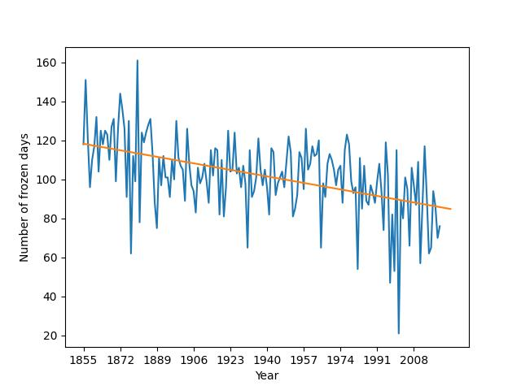

# Artificial Intellegence

Hi! I wanted to share a few AI projects that I have done over the last few years. The projects range from demensionality reduction to deep learning. Enjoy!

## Principal Component Analysis
Here is a project I did to learn about dimensionality reduction!

1. [Juypter Notebook demonstrating the code](./PCA/PCA.ipynb)
2. [Underlying code](./PCA/PCA.py)

## Linear Regression
Here is an implementation of a linear regression. I did this project to understand the math behind regressions!

1. [Juypter Notebook demonstrating the code](./linear_regression/linear_regression.ipynb)
2. [Underlying code](./linear_regression/linear_regression.py)
